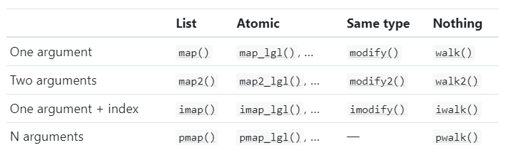

# Appendix: Contents of Advanced R {-}

Hadley Wickham's book, *Advanced R*, has **five** parts:

1. Foundations (Ch 1 - 8)
1. Functional programming (Ch 9 - 11)
1. Object oriented programming (Ch 12 - 16)
1. Metaprogramming (Ch 17 - 21)
1. Debugging, performance (using C++) (Ch 22 - 25)

**Chapter 1** Introduction

**Chapter 2** Names and values

- value has a name; name point to a value
- modify-on-copy

**Chapter 3** Vectors

Vectors consist of
- atomic vectors
    - logical 
    - integer
    - double
    - character
- lists: each item of a list is a "vector"
- NULL (a special vector with length being 0)

Other **objects** are built upon vectors by adding one or more *attributes*

- matrix: vector + `dim` attribute
- data.frame: list + `names` attribute + `row.names` attribute + `class = data.frame` attribute
- factor: integer vector + `class = factor` attribute + `levels` attribute
- Dates: double vector + `Date` attribute

**Chapter 4** Subsetting

For an atomic vector, using `[something]`. Six ways (indicated by "something"): 
a) a positive integer vector; b) a negative integer vector; c) 0; d) empty; e) a logical vector
f) a character vector

For a matrix, using `[ , ]`. Note using '[ , , drop = FALSE]' 

For a list, using `[]` or `[ , ]`. To have **one item**, using `[[]]` or `$`.


**Chapter 5** Control flow

- `if(condi) {}`
- `if(condi) {} else {}`
- for loop

**Chapter 6** Functions

A function has three components: a) formula (arguments); b) body; c) environment

- A function is an **object**
- A function is often has a name; sometimes we use anonymous functions
- Functions can be put in a list
- How a function find its data
    - where: 
        - current environment ("name masking")
        - if not, one level up
    - when:
        - fresh start (new environment will be created)
        - dynamic look up
- Using `on.exit` to restore old setting (e.g. working directory)

**Chapter 7** Environment 

Just a reference

**Chapter 8** Conditions

This chapter is about using

- `stop()`
- `warning()`
- `message()`

**Chapter 9** Functionals

Base R:

- `apply()` (for matrix)
- `lapply()` (for list; returns a list)
- `vapply()` ('v' is for verbose)

`purrr` package

Map family

- `map()` + `map_lgl()`  ...
- `map2()` + `map_int()`  ...
- `pmap()` + `pmap_dbl()` ...

Modify family

- `modify()`
- `modify2()`

Walk family

- `walk()`
- `walk2()`

The following table (taken from Hadley's book) gives a good summary:



Reduce family

- `reduce()`
- `reduce2()`

**Chapter 10** Function factories

This is about writing a function to create many functions.

**Chapter 11** Function operators

Special function factory, where the input is function(s). Just a reference.

**Chapter 12** Base types

Objects in R can be 

- Base
- S3
- S4
- R6 ...

We can check with `sloop::otype(an_obj)`.

There are 25 types in base R.

**Chapter 13** S3

How to create an S3 class: writing three functions

- constructor function
- validator function
- helper function

Define a *generic function* and *methods*
```{r, eval=FALSE}
my_generic <- function(x) {
  UseMethod("my_generic")
}
my_generic.class_1 <- function(x) {
  body
}
my_generic.class_2 <- function(x) {
  body
}
my_generic.class_3 <- function(x) {
  body
}
# using it
my_generic(x)
```


        

