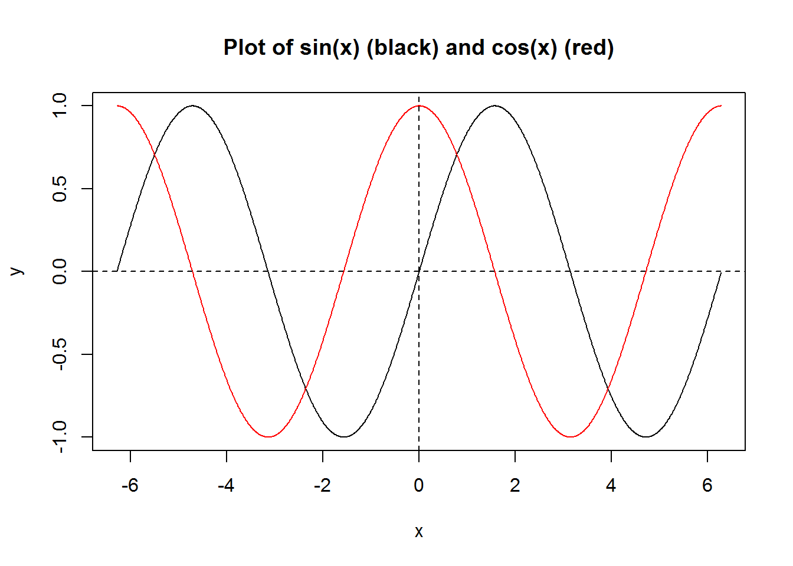

# Lesson 2 Toy Examples {#L2}

There are three toy examples; go through them one by one.
Firstly, think about how to solve the problem by yourself; and then study the example R code.  

**Example 1:** Write an R program to plot $f(x)=\sin(x)$ (black color) and $g(x)=\cos(x)$ (red color) together; $x$ takes values from $-2\pi$ to $2\pi$.


```r
x <- seq(-2*pi, 2*pi, by = 0.01)
y_1 <- sin(x)
y_2 <- cos(x)
plot(x, y_1, type = 'l', col = 'black', xlab = 'x', ylab = 'y',
     main = "Plot of sin(x) (black) and cos(x) (red)")
points(x, y_2, type = 'l', col = 'red')
abline(h = 0, lty = 2)
abline(v = 0, lty = 2)
```



**Example 2:** Check all integers from 1 to 100: if an integer is multiple of 5, then output "F"; if the integer is multiple of 7, then output "S"; if it's multiple of both 5 and 7, then output "FS"; otherwise just output the integer.


```r
nbr <- 1:100
output <- rep("", times = 100)
for(i in nbr) {
  s <- ""
  if(i %% 5 == 0) s <- "F"
  if(i %% 7 == 0) s <- paste0(s, "S")
  if(s != "") {output[i] <- s
  } else {output[i] <- i}
}
print(output)
```

```
##   [1] "1"  "2"  "3"  "4"  "F"  "6"  "S"  "8"  "9"  "F"  "11" "12" "13" "S"  "F" 
##  [16] "16" "17" "18" "19" "F"  "S"  "22" "23" "24" "F"  "26" "27" "S"  "29" "F" 
##  [31] "31" "32" "33" "34" "FS" "36" "37" "38" "39" "F"  "41" "S"  "43" "44" "F" 
##  [46] "46" "47" "48" "S"  "F"  "51" "52" "53" "54" "F"  "S"  "57" "58" "59" "F" 
##  [61] "61" "62" "S"  "64" "F"  "66" "67" "68" "69" "FS" "71" "72" "73" "74" "F" 
##  [76] "76" "S"  "78" "79" "F"  "81" "82" "83" "S"  "F"  "86" "87" "88" "89" "F" 
##  [91] "S"  "92" "93" "94" "F"  "96" "97" "S"  "99" "F"
```

**Example 3:** Write an **R function** to calculate how old you are in days.


```r
library(lubridate) # to use function days()
how_old_in_days <- function(`birth_day_yyyy-mm-dd`)
{today <- Sys.Date()
 print(sprintf("Today is: %s.", today))
 life_in_days <- days(today - as.Date(`birth_day_yyyy-mm-dd`))
 print(sprintf("Your life in days is: %s.", life_in_days))
}
how_old_in_days("2005-12-04") 
```

```
## [1] "Today is: 2023-01-12."
## [1] "Your life in days is: 6248d 0H 0M 0S."
```

